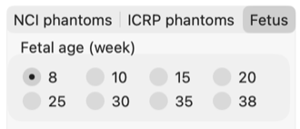
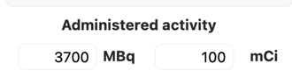
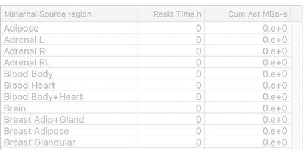
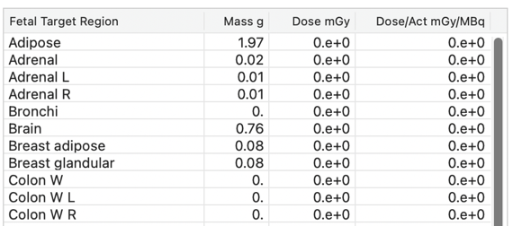

# NCINM 4
_**NCI Dosimetry System for Nuclear Medicine**_

Current documented release: **September 30, 2026 (4.20260930)**
Current release type: **Scientific Update**
Latest scientific update: **September 30, 2026**

---

## Introduction

The **National Cancer Institute Dosimetry System for Nuclear Medicine (NCINM)**
is a reference internal dosimetry program developed by the National Cancer
Institute (NCI) for estimating organ absorbed doses and effective dose from
nuclear medicine procedures.

NCINM4 uses pre-calculated S values and, when available, predefined biokinetic
data to calculate organ doses for selected computational human phantoms. The
current release includes NCI, ICRP voxel, ICRP mesh, and fetus phantom
libraries, with mother-to-fetus S values for fetal dose calculations. It
supports population-based dose evaluation, benchmarking, and research
workflows. It is not intended for patient-specific clinical decision support.

---

## Calculation Workflow

| Step | Description |
|---|---|
| 1 | Select the phantom library and available phantom characteristics |
| 2 | Select a radionuclide or radiopharmaceutical, depending on the selected phantom library |
| 3 | Enter administered activity |
| 4 | Review or edit the source-region table |
| 5 | Review the target-organ dose output table |
| 6 | Optionally select source-region rows and click **Export S Values** |
| 7 | Optionally run multiple NCI, ICRP voxel, or ICRP mesh radiopharmaceutical cases through Batch Manager |

Numeric fields accept either dot or comma decimal notation regardless of the
operating-system regional setting.

---

## 1. Phantom Selection

NCINM4 supports four phantom libraries:

- **NCI phantoms**
- **ICRP voxel phantoms**
- **Fetus phantoms**
- **ICRP mesh phantoms**

NCINM4 opens with the **ICRP mesh adult male** phantom selected. Change the
library, sex, or age before calculation when a different reference phantom is
needed.

Each library has its own tab. Select the desired phantom library first, then
choose the available phantom characteristics for that library.

For NCI, ICRP voxel, and ICRP mesh phantoms, select sex and age. The age
radio-button captions are:

- 0
- 1
- 5
- 10
- 15
- 35

The 35-year selection corresponds to the adult phantom.

The ICRP mesh library provides mesh-based organ dose estimates and displays
Monte Carlo uncertainty percentages. Its urinary-bladder target represents the
basal-cell layer; the ICRP voxel library retains the urinary-bladder-wall
target.

For fetus phantoms, select gestational age:

- 8 weeks
- 10 weeks
- 15 weeks
- 20 weeks
- 25 weeks
- 30 weeks
- 35 weeks
- 38 weeks

Fetus calculations represent maternal source regions irradiating fetal target
organs using mother-to-fetus S values.

The phantom display updates automatically when the phantom library, sex, or age
selection is changed.



---

## 2. Radionuclides And Radiopharmaceuticals

NCINM4 provides two calculation pathways.

### 2.1 Radionuclide Tab

Use the **Radionuclide** tab when source-region residence times or cumulated
activities are known and will be entered manually.

Select the radionuclide from the popup menu, then enter source-region residence
times or cumulated activities in the source-region table.

The radionuclide library contains 1070 radionuclides with photon and/or electron
emissions based on ICRP Publication 107 radiation spectrum data.

For fetus phantom calculations, use this tab and enter maternal source-region
data manually. In this mode, source regions correspond to maternal organs and
target regions correspond to fetal organs.

### 2.2 Radiopharmaceutical Tab

Use the **Radiopharmaceutical** tab when predefined biokinetic data should be
loaded automatically for NCI, ICRP voxel, or ICRP mesh phantom calculations.

When a radiopharmaceutical is selected, NCINM4 identifies the matching
radionuclide from the leading radionuclide name in the radiopharmaceutical text
and automatically loads the corresponding source-region residence-time data.

The current library contains 133 reviewed radiopharmaceutical biokinetic
models. Predefined radiopharmaceutical calculations are available from age 1
through adulthood. They are unavailable for newborn phantoms; for newborn
calculations, use the **Radionuclide** tab and enter source-region data manually.
Earlier biokinetic versions extrapolated newborn values from infant data;
newborn data are now marked unavailable to make this limitation explicit.

For fetus phantom calculations, this tab is intentionally blank because
pregnancy-specific radiopharmaceutical biokinetic models are not currently
defined.

---

## 3. Administered Activity

Administered activity can be entered in **MBq** or **mCi**. The two fields are
linked:

- Entering MBq and pressing Enter updates mCi using `1 mCi = 37 MBq`
- Entering mCi and pressing Enter updates MBq

The default activity is:

| Unit | Default |
|---|---:|
| MBq | 3700 |
| mCi | 100 |



---

## 4. Source-Region Biokinetic Data

The source-region table has column headers:

| Column | Purpose |
|---|---|
| Source Region | Source organ or region |
| Resid Time h | Residence time in hours |
| Cum Act MBq-s | Cumulated activity in MBq-s |

The first column is labeled **Source Region** for NCI and ICRP phantoms. On
the Fetus tab, it changes to **Maternal Source region** to identify the source
regions as maternal anatomy.



For radionuclide-based calculations, users enter residence time or cumulated
activity manually. NCINM4 converts between them using:

```text
cumulated activity (MBq-s) = administered activity (MBq) x residence time (h) x 3600
```

For radiopharmaceutical-based calculations, source-region residence times are
loaded automatically after the radiopharmaceutical is selected. This pathway is
available for NCI, ICRP voxel, and ICRP mesh phantom calculations.

For fetus phantom calculations, source regions are maternal organs. The fetus
library includes 70 maternal source regions, including placenta and amniotic
fluid, plus a remainder source. Enter the source-region residence times or
cumulated activities manually.

Rows with non-zero residence time are shaded automatically. If the residence
time is changed back to zero, the row returns to the default background.

For S-value export, select one or more source-region rows in this table. There
is no separate S-value export column.

### Remainder

The **Remainder** row represents activity outside the explicitly assigned
source regions. NCINM excludes contents and overlapping source entries, then
normalizes the remaining tissue-volume weights to sum to one. The ICRP mesh
library currently uses ICRP voxel source volumes for this weighting.

For mesh remainder activity, the oesophagus uses whole-wall source
coefficients, while bronchial tissue uses the available `Bronchi-f` source as
an approximation. Detailed respiratory modelling and assessment of this
approximation's effect on dose remain future work; its effect has not yet been
quantified.

---

## 5. Target-Organ Dose Output

The target-region output table has column headers:

| Column | Purpose |
|---|---|
| Target Region | Target organ or tissue |
| Mass g | Target-organ mass in grams |
| Dose mGy | Absorbed dose in mGy |
| Dose/Act mGy/MBq | Absorbed dose per administered activity |
| MC uncert % | Monte Carlo uncertainty for ICRP mesh results |

The first column is labeled **Target Region** for NCI and ICRP phantoms. On
the Fetus tab, it changes to **Fetal Target Region**.



NCINM4 calculates dose from S values, administered activity, and source-region
residence time. Effective dose is reported in the final row for NCI and ICRP
voxel or mesh phantom calculations.

The **MC uncert %** column is populated for ICRP mesh calculations and
left blank for the other phantom libraries. It reports calculation-library
uncertainty and does not include uncertainty in administered activity,
biokinetic data, or individual patient anatomy.

For fetus phantom calculations, the output table reports absorbed dose to fetal
target organs using mother-to-fetus S values.

---

## 6. Export S Values


To export S values:

1. Select one or more source-region rows in the source-region table.
2. Click **Export S Values**.
3. Save the generated CSV file.

The exported file contains S values in `mGy/MBq-s` for the selected source
regions and the currently selected phantom. For fetus phantoms, the exported
values are mother-to-fetus S values for the selected maternal source regions and
fetal target organs. The CSV columns are `Source Region`, `Target Region`, and
`S Value (mGy/MBq-s)`.

---

## 7. Batch Manager

Batch Manager runs multiple NCI, ICRP voxel, or ICRP mesh
radiopharmaceutical dose calculations from a CSV input file. Use phantom
library `1` for NCI, `2` for ICRP voxel, or `4` for ICRP mesh.

Batch input accepts comma- or semicolon-delimited CSV files. Semicolon-delimited
CSV is recommended when decimal commas are used. In a comma-delimited file, a
value containing a decimal comma must be enclosed in double quotes. Saved Batch
CSV output always uses comma delimiters and dot decimals for consistent reuse
across regional settings.

When NCINM4 reads a radiopharmaceutical name from the batch CSV, it
automatically matches the submitted text to the closest library entry using
fuzzy matching. This allows clinical-style names and common radionuclide
notation variants such as `F-18`, `18F`, `Tc-99m`, and `99mTc`.

Batch Manager also matches the submitted patient age to the nearest available
phantom age group. The output CSV includes resolved input values,
radiopharmaceutical match information, and organ dose columns.

Fetus phantom calculations are not currently supported through the
radiopharmaceutical Batch Manager because pregnancy-specific
radiopharmaceutical biokinetic models are not currently defined. Newborn
radiopharmaceutical rows return an explicit unavailable-data error rather than
a zero-dose result.

The downloadable `ncinmBatchInput.csv` exercises library codes 1–4 with FDG.
It contains nine supported adult/child cases using libraries 1, 2, and 4, plus
one deliberately unsupported library-3 row named `lib3_fetus_expected_error`.
Expected output is nine successful calculations and one library-selection
error with blank dose cells. The library-3 row tests input validation; it does
not calculate a fetal dose.

---

## 8. Clear Tables

Click **Clear Tables** to reset administered activity to the default values,
clear source-region residence times and cumulated activities, clear dose output,
and refresh the phantom display.
